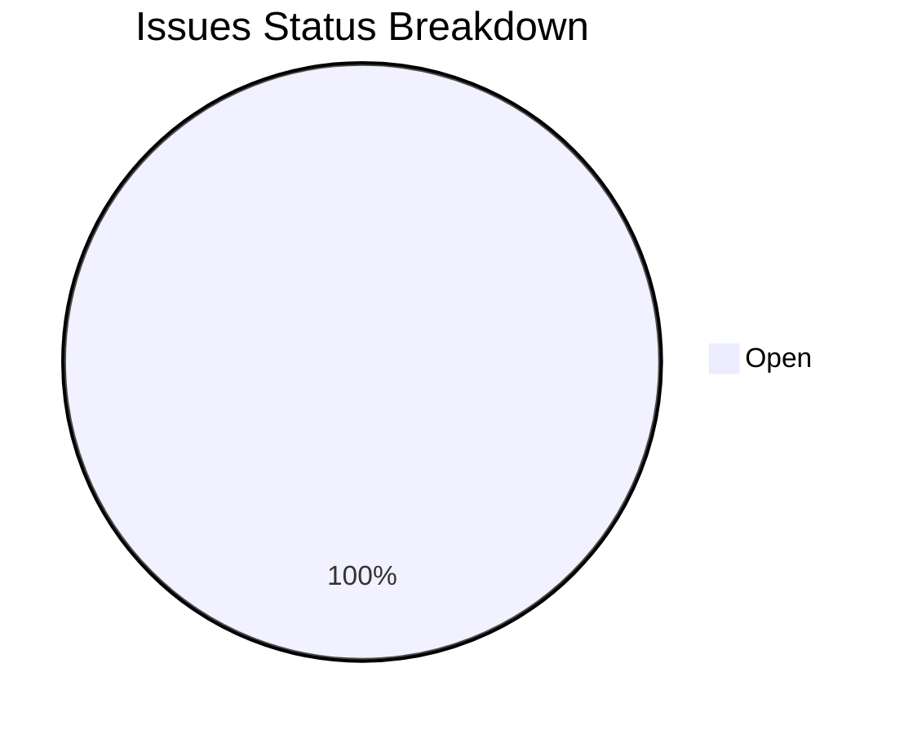

# Along Executive Dashboard & Repository Analytics

> Auto-generated on `2026-08-28 11:28:21` for repository `dynstruct`.

## 1. Executive Summary

| Metric | Value | Details |
| :--- | :--- | :--- |
| **Completion Progress** | `0.0%` | `0` done / `24` total |
| **Active Backlog** | `24` open, `0` in-progress | `0` blocked |
| **Active Risks** | `0` active | `0` critical/high |
| **Milestones Tracked** | `1` | Stage releases |
| **Session Logs / ADRs** | `0` sessions / `1` ADRs | Architectural record |
| **Knowledge Base** | `6` articles | `.along/KB/` documentation |
| **Context Footprint** | `5` lines | `.along/CONTEXT.md` |

## 2. Issues Breakdown

## 3. Active Issues & Backlog

| Status | Type | Priority | Issue | Milestone / Blockers |
| :--- | :--- | :--- | :--- | :--- |
| `open` | `debt` | `low` | [Move asyncToGeneratorFlow helper to utico](file:///.along/ISSUES/debt--async-to-generator-flow.md) | v2.0.0-along-transition |
| `open` | `debt` | `high` | [Ensure user code execution is properly handled across all boundaries](file:///.along/ISSUES/debt--safe-user-code-execution.md) | v2.0.0-along-transition |
| `open` | `feat` | `medium` | [Add automatic validation for component children declarations](file:///.along/ISSUES/feat--automatic-children-validation.md) | v2.0.0-along-transition |
| `open` | `feat` | `medium` | [Declarative telemetry & analytics annotations in component structures](file:///.along/ISSUES/feat--business-telemetry-declarations.md) | v2.0.0-along-transition |
| `open` | `feat` | `medium` | [Support component classification types (resource-boundary, layout, UI)](file:///.along/ISSUES/feat--component-type-metadata.md) | v2.0.0-along-transition |
| `open` | `feat` | `medium` | [Support component state persistence via configurable providers](file:///.along/ISSUES/feat--control-persistence-providers.md) | v2.0.0-along-transition |
| `open` | `feat` | `medium` | [Support granular access control for component models and channels](file:///.along/ISSUES/feat--granular-access-control.md) | v2.0.0-along-transition |
| `open` | `feat` | `low` | [Implement GraphQL transport integration for dynstruct](file:///.along/ISSUES/feat--graphql-integration.md) | v2.0.0-along-transition |
| `open` | `feat` | `medium` | [Adapt dynstruct HttpClient for Kubb and Orval Generators](file:///.along/ISSUES/feat--http-adapters-kubb-orval.md) | v2.0.0-along-transition |
| `open` | `feat` | `high` | [Support request cancellation in HttpClient](file:///.along/ISSUES/feat--http-request-cancellation.md) | v2.0.0-along-transition |
| `open` | `feat` | `medium` | [LiveStore reactive query integration and real-time dashboard components](file:///.along/ISSUES/feat--livestore-reactive-dashboard-widgets.md) | v2.0.0-along-transition |
| `open` | `feat` | `medium` | [Support reactive navigation context dependencies in NavService](file:///.along/ISSUES/feat--nav-service-dependencies.md) | v2.0.0-along-transition |
| `open` | `feat` | `medium` | [Support RFC 7807 problem+json format in HttpClientError](file:///.along/ISSUES/feat--problem-details-http-errors.md) | v2.0.0-along-transition |
| `open` | `feat` | `low` | [Add accepts headers and crossDomain support in IRequestParams](file:///.along/ISSUES/feat--request-accepts-and-cors.md) | v2.0.0-along-transition |
| `open` | `feat` | `medium` | [Support Server-Sent Events (SSE) transport in dynstruct](file:///.along/ISSUES/feat--server-sent-events-support.md) | v2.0.0-along-transition |
| `open` | `feat` | `low` | [Implement SignalR transport integration for dynstruct](file:///.along/ISSUES/feat--signalr-integration.md) | v2.0.0-along-transition |
| `open` | `feat` | `low` | [Support one-way prop binding with a single getter function](file:///.along/ISSUES/feat--single-getter-prop-binding.md) | v2.0.0-along-transition |
| `open` | `feat` | `medium` | [Support skeleton and not-ready component states](file:///.along/ISSUES/feat--skeleton-not-ready-state.md) | v2.0.0-along-transition |
| `open` | `feat` | `medium` | [Add APP.STORE.HAS and APP.STORE.CLEAR common channels](file:///.along/ISSUES/feat--store-has-and-clear-channels.md) | v2.0.0-along-transition |
| `open` | `feat` | `low` | [Implement React (TanStack) Query integration for dynstruct](file:///.along/ISSUES/feat--tanstack-query-integration.md) | v2.0.0-along-transition |
| `open` | `feat` | `low` | [Implement tRPC transport integration for dynstruct](file:///.along/ISSUES/feat--trpc-integration.md) | v2.0.0-along-transition |
| `open` | `feat` | `medium` | [Support visibility and interaction modes with security integration and fallback view](file:///.along/ISSUES/feat--visibility-interaction-states.md) | v2.0.0-along-transition |
| `open` | `feat` | `medium` | [Support WebSocket transport in request interface](file:///.along/ISSUES/feat--websocket-transport-support.md) | v2.0.0-along-transition |
| `open` | `feat` | `medium` | [Support WWW-Authenticate response header in SecurityService](file:///.along/ISSUES/feat--www-authenticate-header-support.md) | v2.0.0-along-transition |

## 5. Milestones & Sprints

| Milestone | Status | Due Date | Progress |
| :--- | :--- | :--- | :--- |
| [v2.0.0: Transition to Along Ecosystem & .along/ Directory](file:///.along/MILESTONES/v2.0.0-along-transition.md) | `in-progress` | `2026-09-05` | `50%` |

