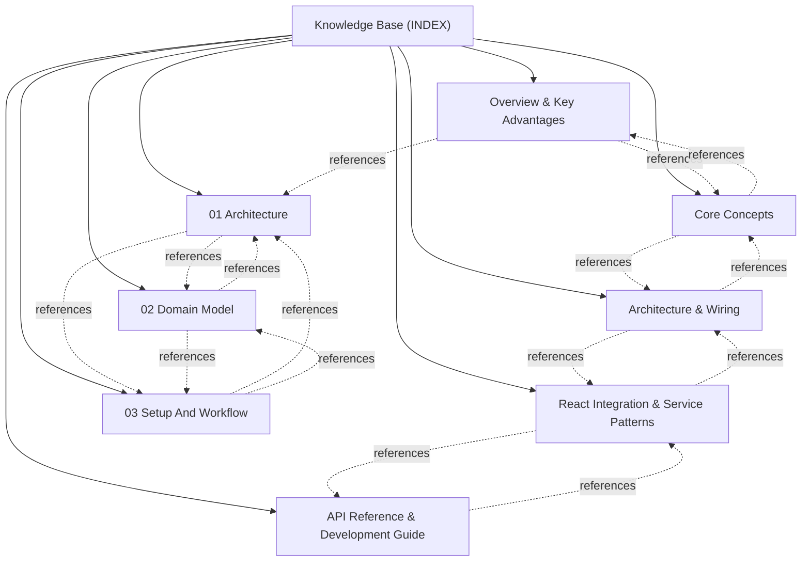

# Knowledge Base Topic Index

Central entry point and cross-linked topic catalog for project documentation:

## Knowledge Graph & Topic Map

---

## Articles

- **[Overview & Key Advantages](./topic--01-overview-and-advantages.md)** (topic) `01-overview-and-advantages`
- **[Core Concepts](./topic--02-core-concepts.md)** (topic) `02-core-concepts`
- **[Architecture & Wiring](./topic--03-architecture-and-wiring.md)** (topic) `03-architecture-and-wiring`
- **[React Integration & Service Patterns](./topic--04-react-integration.md)** (topic) `04-react-integration`
- **[API Reference & Development Guide](./topic--05-api-reference.md)** (topic) `05-api-reference`
- **[01 Architecture](./topic--architecture.md)** (topic) `architecture`
- **[02 Domain Model](./topic--domain-model.md)** (topic) `domain-model`
- **[03 Setup And Workflow](./topic--setup-and-workflow.md)** (topic) `setup-and-workflow`
- **[License](./topic--license.md)** (license) `license`

---

## Related Context

- [AGENTS.md](../AGENTS.md): Active protocol conventions and rules.
- [.along/DECISIONS.md](../.along/DECISIONS.md): Architectural Decision Records.
- [.along/ISSUES.md](../.along/ISSUES.md): Active issue tracking board.
- [.along/HISTORY.md](../.along/HISTORY.md): Append-only project history log.
